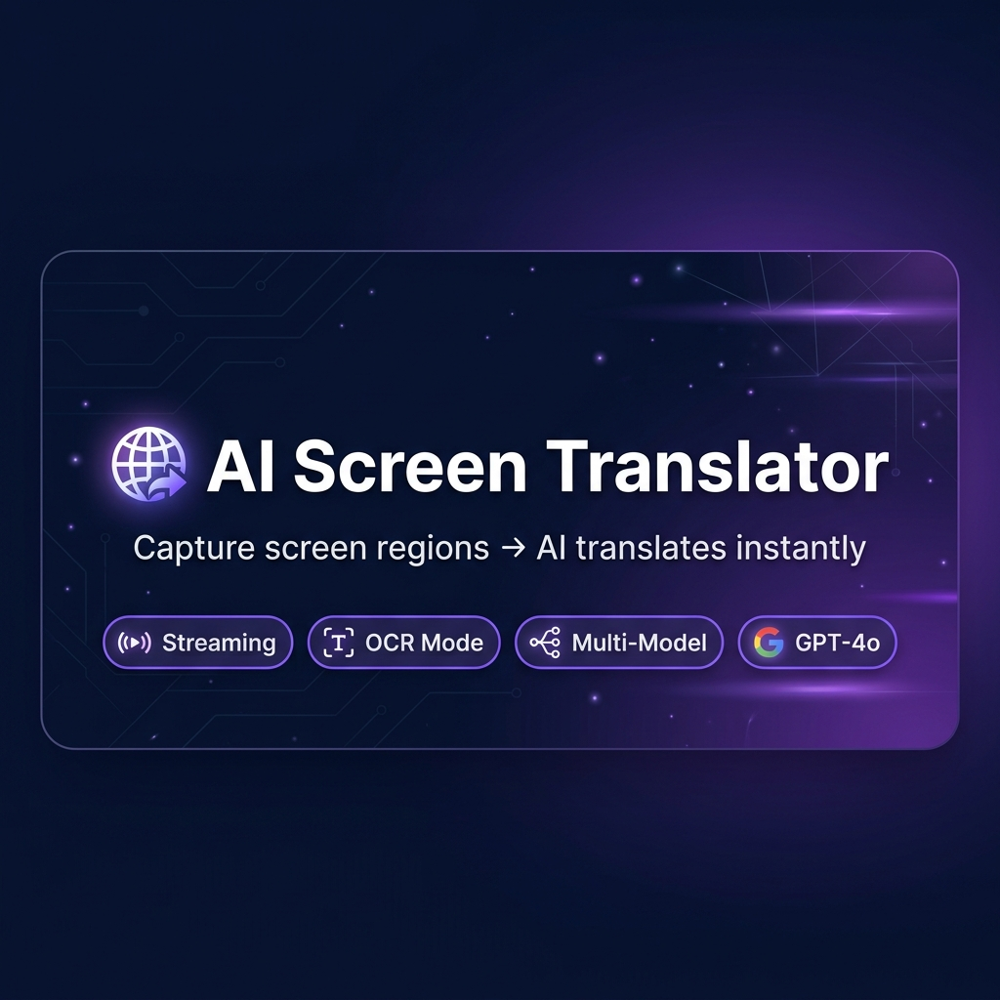
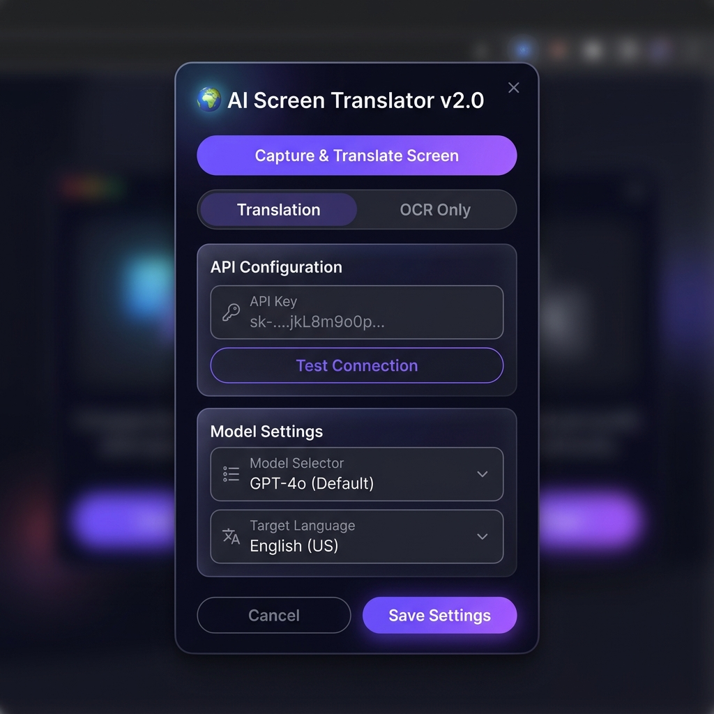
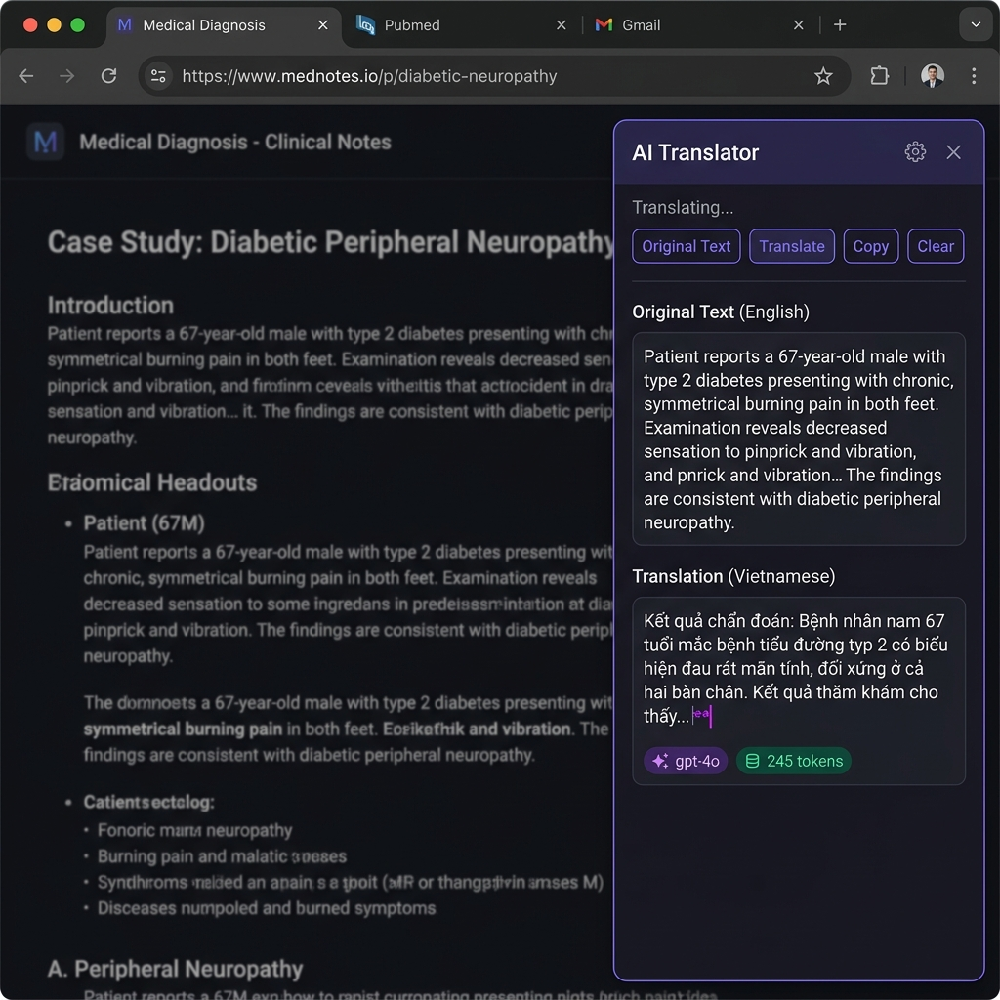

<p align="center">
  
</p>

<h1 align="center">🌐 AI Screen Translator</h1>

<p align="center">
  <strong>Chụp vùng màn hình → AI đọc & dịch tức thì</strong><br>
  Hỗ trợ đọc PDF/ebook bị khóa copy • Streaming real-time • OCR
</p>

<p align="center">
  
  
  
  
</p>

---

## ✨ Tính năng

| Tính năng | Mô tả |
|-----------|-------|
| ⚡ **Streaming Response** | Text hiện real-time từng chữ, không cần đợi AI xử lý xong |
| 📝 **OCR Mode** | Trích xuất text từ ảnh mà không dịch — copy text từ PDF bị khóa |
| 🧪 **Test Connection** | Kiểm tra API Key hoạt động tức thì trước khi sử dụng |
| 🤖 **Multi-Model** | Chọn GPT-4o (tốt nhất) / GPT-4o-mini (rẻ 17x) / GPT-4.1 |
| 📊 **Token Tracking** | Hiển thị model & số tokens đã dùng trên mỗi response |
| 📋 **Copy từng đoạn** | Nút copy riêng cho mỗi section (nguyên văn / bản dịch) |
| 💾 **Export .txt** | Lưu toàn bộ phiên dịch thành file text |
| 🖱️ **Context Menu** | Chuột phải → "Chụp & Dịch vùng này" |
| 🌍 **9 ngôn ngữ** | Việt, Anh, Trung, Nhật, Hàn, Pháp, Đức, Tây Ban Nha, Thái |
| 📚 **Lịch sử dịch** | Tự động lưu, không mất khi refresh trang |

## 📸 Screenshots

<p align="center">
  
  &nbsp;&nbsp;&nbsp;
  
</p>

## 🚀 Cài đặt

### Cách 1: Từ source code

```bash
# Clone repo
git clone https://github.com/nguyenduchoai/ai-translate-extension.git

# Hoặc tải ZIP và giải nén
```

1. Mở Chrome → gõ `chrome://extensions/`
2. Bật **Developer mode** (góc trên bên phải)
3. Click **"Load unpacked"**
4. Chọn thư mục `ai-translate-extension`
5. Ghim 📌 extension lên toolbar

### Cách 2: Từ file ZIP

1. Tải file `ai-translate-extension-v2.0.zip` từ [Releases](../../releases)
2. Giải nén
3. Load unpacked vào Chrome như trên

## ⚙️ Cấu hình

1. Click icon extension 🌐 trên toolbar
2. Nhập **OpenAI API Key** (lấy tại [platform.openai.com/api-keys](https://platform.openai.com/api-keys))
3. Click **🧪 Test kết nối** — xác nhận key hoạt động
4. Chọn Model AI:

| Model | Chất lượng | Giá |
|-------|-----------|-----|
| GPT-4o | ⭐⭐⭐⭐⭐ Tốt nhất | ~$2.50/1M tokens |
| GPT-4o-mini | ⭐⭐⭐⭐ Đủ dùng | ~$0.15/1M tokens |
| GPT-4.1 | ⭐⭐⭐⭐⭐ Mới nhất | ~$2.00/1M tokens |
| GPT-4.1-mini | ⭐⭐⭐⭐ Cân bằng | ~$0.40/1M tokens |

5. Chọn ngôn ngữ đích → **💾 Lưu cài đặt**

## 🎯 Cách sử dụng

### Dịch thuật

```
Alt + Q  →  Kéo chuột chọn vùng  →  AI stream kết quả real-time ⚡
```

Hoặc: **Chuột phải** trên trang → **🌐 Chụp & Dịch vùng này**

### Trích xuất text (OCR)

1. Mở popup → chọn **📝 Chỉ trích text (OCR)**
2. `Alt + Q` → Kéo chọn vùng → AI trả text gốc chính xác

### Phím tắt

| Phím | Chức năng |
|------|-----------|
| `Alt + Q` | Chụp & Dịch / OCR |
| `ESC` | Hủy chọn vùng |

> 💡 Đổi phím tắt tại `chrome://extensions/shortcuts`

## 🏗️ Cấu trúc dự án

```
ai-translate-extension/
├── manifest.json      # Chrome Extension config (Manifest V3)
├── background.js      # Service worker: API calls, streaming, capture
├── content.js         # UI injection: selection, result panel, streaming display
├── content.css        # Styles injected vào mọi trang
├── popup.html         # Popup UI: settings, model selector, test connection
├── popup.js           # Popup logic
├── guide.html         # Hướng dẫn chi tiết
├── icons/             # Extension icons (16, 48, 128px)
└── screenshots/       # Hình minh họa cho README
```

## 🔒 Bảo mật

- API Key được lưu **cục bộ** trong Chrome Storage (`chrome.storage.sync`)
- **Không gửi key** đến bất kỳ server nào ngoài OpenAI
- Không thu thập dữ liệu người dùng
- Mã nguồn mở 100%

## 🌍 Use Cases

- 📖 **Đọc ebook bị khóa** — Sách y khoa, kỹ thuật, tài liệu chuyên ngành
- 📄 **PDF không copy được** — Tài liệu academia, nghiên cứu khoa học
- 🖥️ **Dịch nhanh màn hình** — Bất kỳ text nào hiện trên màn hình
- 📝 **OCR thông minh** — Trích xuất text từ hình ảnh, screenshot

## 🛠️ Tech Stack

- **Chrome Extension Manifest V3**
- **OpenAI API** (GPT-4o Vision + Streaming)
- **Vanilla JS** — Không framework, nhẹ, nhanh
- **OffscreenCanvas** — Crop ảnh trong service worker

## 📝 Changelog

### v2.0.0 (2026-04-03)
- ⚡ Streaming response — text hiện real-time
- 📝 OCR-only mode
- 🧪 Test Connection button
- 🤖 Multi-model selector (GPT-4o, 4o-mini, 4.1, 4.1-mini)
- 📊 Token usage tracking
- 🖱️ Context menu integration
- 📋 Per-section copy buttons
- 🛡️ Bullet-proof error handling

### v1.0.0 (2026-04-02)
- 🎉 Initial release
- Screen capture + OCR + Translation
- History with auto-save
- Export to .txt file

## 📄 License

MIT License — Tự do sử dụng, chỉnh sửa, phân phối.

---

<p align="center">
  Made with ❤️ for Vietnamese readers<br>
  <sub>By <a href="https://github.com/nguyenduchoai">nguyenduchoai</a></sub>
</p>
