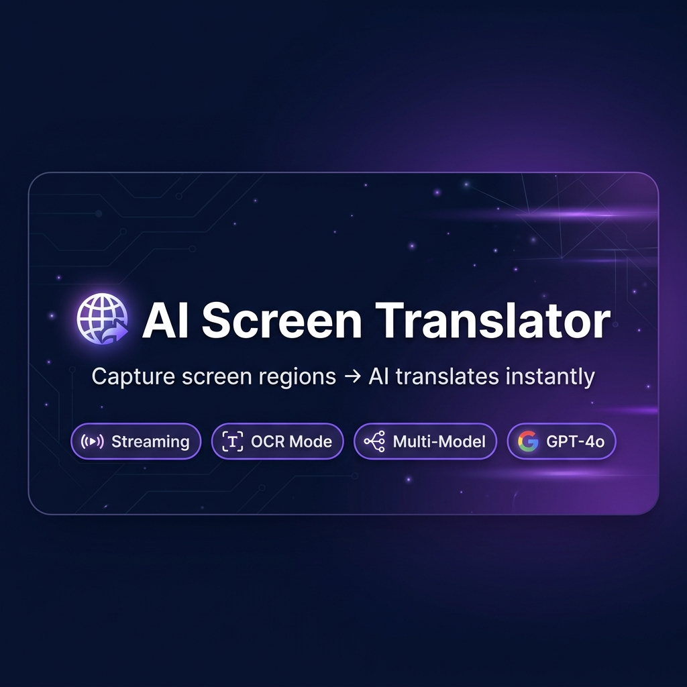
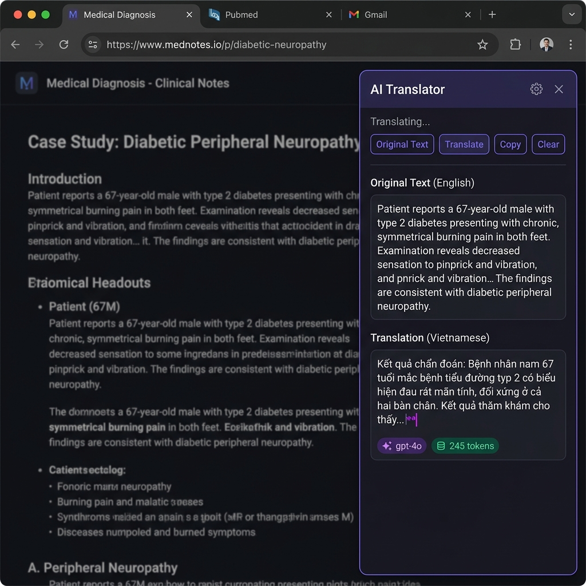

<p align="center">
  
</p>

<h1 align="center">🌐 AI Screen Translator</h1>

<p align="center">
  <strong>Chụp vùng màn hình → Chia đôi trình duyệt → AI đọc & dịch tức thì</strong><br>
  Hỗ trợ đọc truyện, PDF/ebook bị khóa copy • Streaming real-time • Chrome Side Panel
</p>

<p align="center">
  
  
  
  
</p>

---

## ✨ Tính năng Nổi bật (v2.4.0)

| Tính năng | Mô tả |
|-----------|-------|
| 🖥️ **Chrome Side Panel** | Dịch thuật theo cơ chế Split-screen nguyên bản trình duyệt, không làm vỡ giao diện web |
| ⚡ **Streaming Response** | Text tiếng Việt hiện real-time từng chữ giống hệt ChatGPT |
| 📝 **OCR Mode** | Trích xuất văn bản từ hình ảnh/truyện tranh — copy text từ PDF bị khóa |
| 🧪 **Thiết lập nhanh gọn** | Cài đặt API Key và model nằm gọn trong Bánh răng (⚙) của Side Panel |
| 🤖 **Multi-Model** | OpenAI GPT-4o / GPT-4o-mini và Google Gemini; nhập mã model khác nếu cần |
| 🦷 **Dịch nha khoa** | Prompt riêng cho nha khoa, chỉnh nha, implant, nội nha, nha chu, phục hình, phẫu thuật miệng và nha khoa trẻ em |
| 🌍 **9 ngôn ngữ** | Việt, Anh, Trung, Nhật, Hàn, Pháp, Đức, Tây Ban Nha, Thái |
| 💾 **Lưu lịch sử & Export**| Tự động lưu 50 bản dịch gần nhất, hỗ trợ tải về dưới dạng `.txt` |

## 📸 Screenshots

*(Hình ảnh minh họa Giao diện Side Panel)*

<p align="center">
  
</p>

## 🚀 Cài đặt

### Cách 1: Từ mã nguồn

```bash
# Clone repo
git clone https://github.com/nguyenduchoai/AI-Translation-Extension.git
```

1. Mở Chrome → gõ `chrome://extensions/`
2. Bật **Developer mode** (góc trên trành duyệt)
3. Click **"Load unpacked"**
4. Chọn thư mục `AI-Translation-Extension` (thư mục chứa `manifest.json`)
5. **Ghim 📌 extension lên thanh công cụ** để tiện sử dụng.

### Cách 2: Bằng file ZIP

1. Tải file `ai-translate-extension-v2.4.0.zip` từ [Releases](https://github.com/nguyenduchoai/AI-Translation-Extension/releases/latest)
2. Giải nén vào một thư mục
3. Load unpacked thư mục đó tương tự Cách 1.

## ⚙️ Cấu hình API

1. **Click icon Extension** 🌐 trên toolbar để mở khóa giao diện **Side Panel** bên phải màn hình.
2. Click biểu tượng **Bánh răng (⚙️)** để mở giao diện cài đặt.
3. Chọn **Nhà cung cấp AI**: **Google Gemini** hoặc **OpenAI**.
4. Nhập key tương ứng: [Google AI Studio](https://aistudio.google.com/apikey) cho Gemini, hoặc [OpenAI](https://platform.openai.com/api-keys).
5. Chọn model. Gemini mặc định `gemini-3.8-flash`, có `gemini-3.5-flash-lite`; **Model khác…** cho phép nhập mã model hỗ trợ ảnh có sẵn trong tài khoản.
6. Chọn **Dịch thuật → Nha khoa** hoặc phân ngành phù hợp, ngôn ngữ đích **Tiếng Việt**.
7. Click **🧪 Test Server**, rồi **💾 Lưu lại**. Test có gửi một yêu cầu nhỏ tới API; quota/chi phí theo tài khoản nhà cung cấp.

API key và model của hai nhà cung cấp được lưu riêng. Bản nâng cấp giữ lại cài đặt OpenAI cũ. Cài đặt dùng `chrome.storage.sync` và có thể đồng bộ qua Chrome; lịch sử ảnh/bản dịch nằm trong `chrome.storage.local`. Chỉ vùng ảnh đã chọn được gửi tới nhà cung cấp AI đã chọn.

### Prompt nha khoa

Prompt giữ cấu trúc, thuật ngữ chuyên ngành, số răng/hệ đánh số, liều lượng, đơn vị, nồng độ, trích dẫn và các phủ định trong nguồn. Không tự thêm chẩn đoán, khuyến nghị hay dữ kiện không có trong ảnh; chỗ mờ được đánh dấu. Bản dịch chỉ xuất ngôn ngữ đích, không tự thêm bản song ngữ. Chế độ **Chỉ trích Text** dùng prompt OCR riêng, không dịch.

Triển khai Gemini dựa trên [GenerateContent/streamGenerateContent](https://ai.google.dev/api/generate-content), [Gemini 3.8 Flash](https://ai.google.dev/gemini-api/docs/models/gemini-3.8-flash) và [Gemini 3.5 Flash-Lite](https://ai.google.dev/gemini-api/docs/models/gemini-3.5-flash-lite). Quyền truy cập model phụ thuộc tài khoản API.

## 🎯 Cách sử dụng

### Dịch thuật nhanh

```
Alt + Q  →  Kéo chuột tạo khung chữ nhật  →  AI xuất luồng chữ chạy lập tức ⚡
```

Hoặc sử dụng chuột: **Chuột phải** trên trình duyệt → **🌐 Chụp & Dịch vùng này**

### Trích xuất text đơn thuần (Copy text truyện/ảnh)

1. Mở Cài đặt trong Side Panel (⚙️) → Chọn **📝 Chỉ trích Text** → **💾 Lưu lại**
2. Nhấn `Alt + Q` quét đoạn cần lấy $\Rightarrow$ extension sẽ gõ ra đúng hệt nguyên bản để bạn Copy.

### Phím tắt mặc định

| Phím | Chức năng |
|------|-----------|
| `Alt + Q` | Kích hoạt con trỏ cắt màn hình |
| `ESC` | Hủy việc đang chọn vùng |

> 💡 *Bạn có thể thay đổi phím tắt trong `chrome://extensions/shortcuts`*

## 🏗️ Cấu trúc thư mục (v2.2)

```
ai-translate-extension/
├── manifest.json      # Chrome Extension config (Hỗ trợ Side Panel permission)
├── background.js      # Service Worker: Logic screenshot, bắt API streaming, push data
├── content.js         # Content Script: Tool cắt ảnh trên web, con trỏ crosshair
├── content.css        # Reset layout an toàn
├── sidepanel.html     # Giao diện Native Side Panel (Chia đôi web)
├── sidepanel.js       # UI logic: streaming, lưu trữ, config, nút copy/xóa
└── ...
```

## Kiểm tra và đóng gói

Yêu cầu Node.js 20+ và Python 3; không cần cài thư viện ngoài.

```bash
npm test
npm run package
# Hoặc kiểm tra phiên bản tag trước khi phát hành:
python3 scripts/package-extension.py --tag v2.4.0
```

ZIP nằm tại `dist/ai-translate-extension-v2.4.0.zip`, có `manifest.json` ngay gốc. Giải nén rồi **Load unpacked**; Chrome không nạp trực tiếp file ZIP. Khi cập nhật bản cũ, thay nội dung trong đúng thư mục đã nạp rồi bấm **Reload** tại `chrome://extensions/` để giữ ID/cài đặt.

Workflow `.github/workflows/release.yml` chạy test, đóng ZIP chỉ gồm file runtime và đính kèm checksum vào Release khi push tag `v*`. Test tự động dùng phản hồi API mô phỏng; xác nhận dịch thật cần API key của nhà cung cấp.

## 📝 Changelog

### v2.4.0 (2026-09-29)
- Thêm Google Gemini cho dịch ảnh, OCR và streaming; key/model riêng cho từng nhà cung cấp.
- Làm rõ prompt nha khoa và các phân ngành, giữ dữ kiện gốc và đánh dấu chữ không rõ.
- Sửa khởi tạo nút Copy/Export; hỗ trợ mã model tùy chỉnh.
- Có ZIP cài đặt và SHA-256 trên Releases; tự đóng gói khi đẩy tag phiên bản.

### v2.3.0 (2026-04-03)
- Thêm lựa chọn chuyên ngành và prompt dịch học thuật.

### v2.2.0 (2026-04-03)
- 🖥️ Nâng cấp toàn diện kiến trúc UI sang **Chrome Side Panel API**.
- ✂️ Loại bỏ Popup rườm rà, gộp Settings (Cài đặt) thẳng vào Side Panel.
- 🖱️ Nhấn icon extension tự mở Side panel lập tức.
- 🪲 Sửa dứt điểm lỗi bóng mờ đen (Zombie Injections) khi ấn nút nhiều lần.
- 👻 Màn hình cắt ảnh (selection) được làm trong suốt 100% không bị mờ đen.

### v2.0.0 (2026-04-03)
- ⚡ Streaming response (Tách stream chữ).
- 📝 OCR-only mode (Model Vision).
- 🖱️ Tính năng Context Menu.

### v1.0.0 
- 🎉 Initial framework release.

## 📄 License
MIT License. Tự do sửa đổi, biên dịch và nâng cấp theo mục đích cá nhân.

---

<p align="center">
  Made with ❤️ for Vietnamese readers<br>
  <sub>By <a href="https://github.com/nguyenduchoai">nguyenduchoai</a></sub>
</p>
